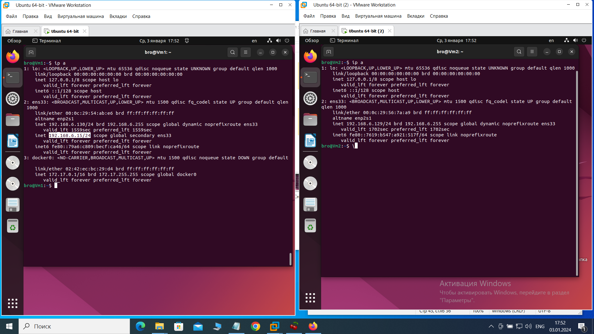

Аварийное восстановление и Keepalived Брюхов А SYS-26

Решение 1

Решение 2

1. Установка и настройка Keepalived

    Установите Keepalived на обе виртуальные машины:

sudo apt-get update
sudo apt-get install keepalived

2.Создал конфигурационный файл для Keepalived на обеих машинах. Пример:

На первой машине (primary): /etc/keepalived/keepalived.conf

vrrp_instance VI_1 {
        state MASTER
        interface ens33
        virtual_router_id 15
        priority 255
        advert_int 1

        virtual_ipaddress {
              192.168.6.15/24
        }

}

На второй машине (backup): /etc/keepalived/keepalived.conf

vrrp_instance VI_1 {
        state BACKUP
        interface ens33
        virtual_router_id 15
        priority 200
        advert_int 1

        virtual_ipaddress {
              192.168.6.15/24
        }

}

Запуск сервиса Keepalived на обеих машинах:

    sudo systemctl start keepalived

3. Установка веб-сервера

sudo apt-get install nginx

